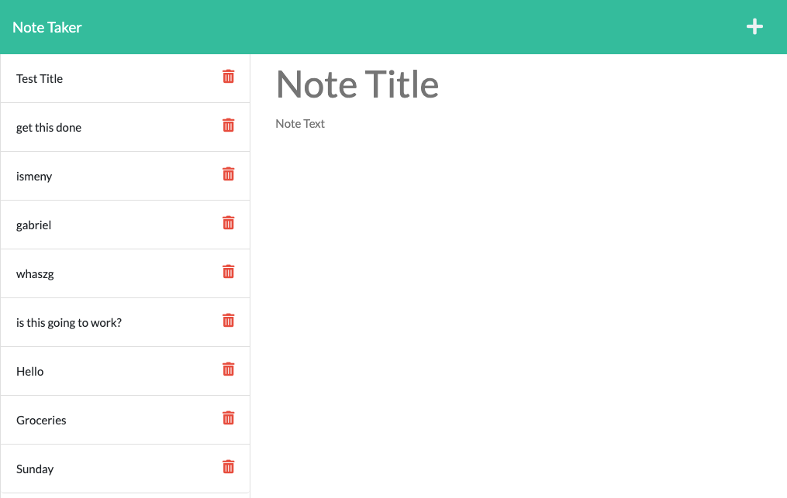

# Note-Taker

## Description
This is a note taking application that uses Express.js in the back end and will save and retrieve note data from a JSON file. 

## Table of contents
  - [Installation](#installation)
  - [Usage](#usage)
  - [Credits](#credits)
  - [License](#license)
  - [Test](#test)
  - [Questions](#questions)
  

## Installation
Deployed URL link  : ***https://note-taker-ismeny.herokuapp.com/***  
Landing Page

Notes Page

Save Note

View Saved Note

## Usage
When you go to the application you will be presented with the landing page with a link to a notes page. When you click on the link to the notes page then you will be presented with existing notes listed on the left-hand column, plus empty fields to enter a new note title and the note's text in the right-hand column. After entering the new note information a SAVE icon will appear in the navigation at the top of the page. When you click on the button to save the new note entered the note will then appear in the left-hand column with the other existing notes. When you click on the existing note then it will appear in the right-hand column again. 

## Credits
This application uses Express.js  
Received help from:  
Jayla De'nae - peer  
Ethan Cho - peer 

## License
MIT Licensce

## Contributions
n/a
## Test
n/a
## Questions
Github: Ismeny Saguilan - https://github.com/Ismeny  
Email: menysag2@gmail.com